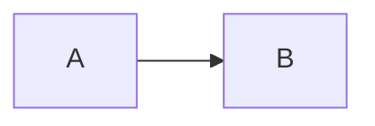

### Hi therre 👋

Work in Progress....
## Don't read it yet!!
## About Me

### 🔭 I’m currently working on ...
A lot of things hold ==my interest== so Currently I'm working on a Mobile game about a cat. Its being develoed on the Unity engine using C#. 

### 🌱 I’m currently learning ...

### - 📫 How to reach me: ...

<!--
**Jiochoa/Jiochoa** is a ✨ _special_ ✨ repository because its `README.md` (this file) appears on your GitHub profile.

Here are some ideas to get you started:

- 🔭 I’m currently working on ...
- 🌱 I’m currently learning ...
- 👯 I’m looking to collaborate on ...
- 🤔 I’m looking for help with ...
- 💬 Ask me about ...
- 📫 How to reach me: ...
- 😄 Pronouns: ...
- ⚡ Fun fact: ...
-->

## About Me
- 🧑‍💻 Tech I work on :

       
      
      
      
       
      
      
      
      
      
      

## My GitHub stats

###  My Github Stats:

## About Me

[Jiochoa](https://github.com/Jiochoa/Jiochoa)